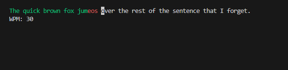

# ⌨️ Speed Typing Test

A fun speed typing test built in Python using the `curses` library. Practice your typing skills and see how fast you can go!

---




## 🚀 Features

- Displays typing speed in **WPM (Words Per Minute)**
- Highlights:
  - ✅ Correct characters in **green**
  - ❌ Mistyped characters in **red**
- Handles backspace and special keys
- Simple terminal interface

---

## 🎮 How to Run

### 1. Clone the Repository

```bash
git clone https://github.com/jessica-murare/WPM-Typing-Test.git
cd speed-typing-test
